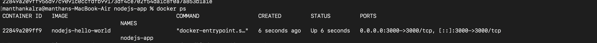
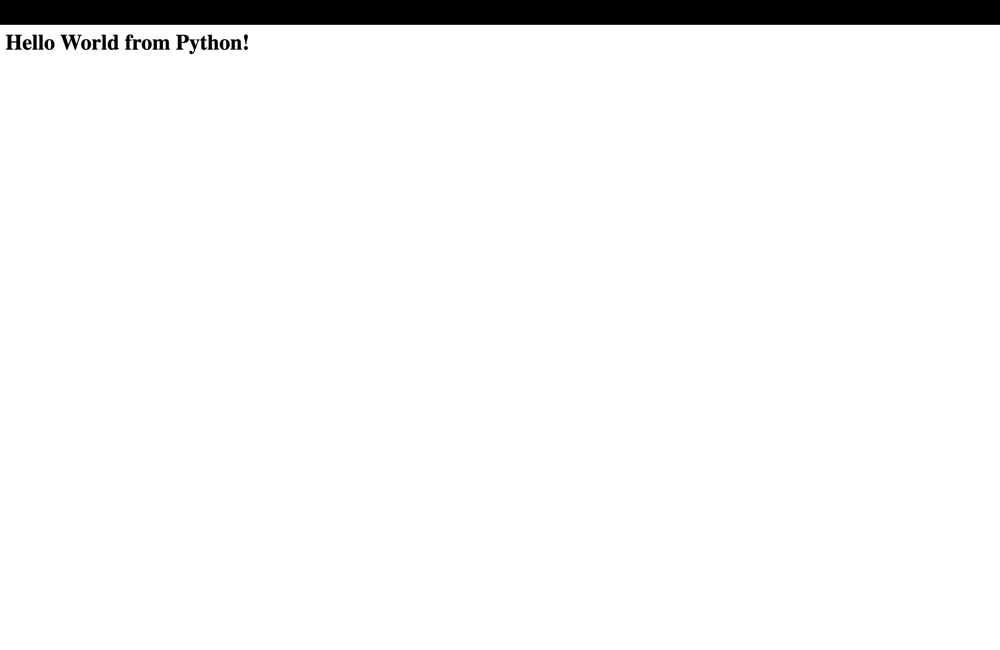
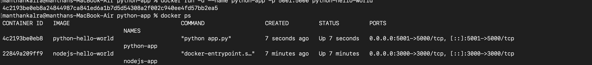
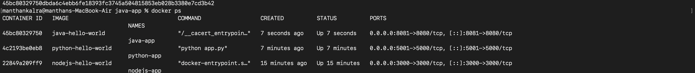
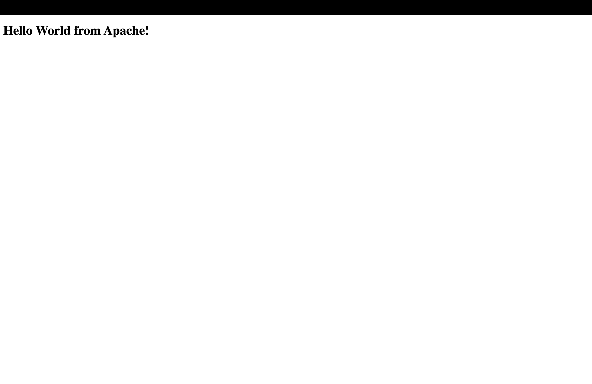
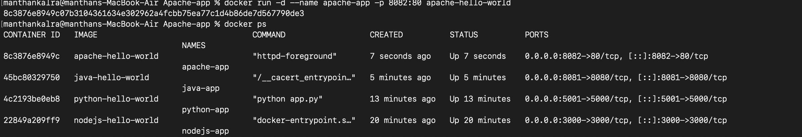
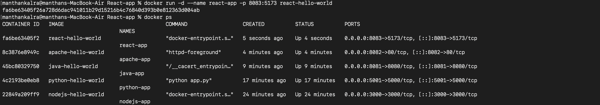
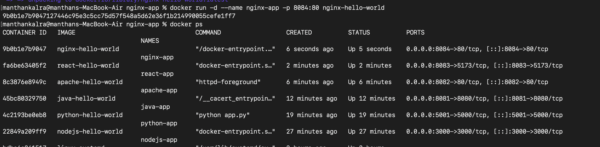

#  Docker Fundamentals
 Tasks

## Screenshots

### Node.js Webpage

### Node.js Docker PS Output

---

### Python Webpage

### Python Docker PS Output

---

### Java Webpage

### Java Docker PS Output

---

### Apache Webpage

### Apache Docker PS Output

---

### React Webpage

### React Docker PS Output

---

### Nginx Webpage

### Nginx Docker PS Output

