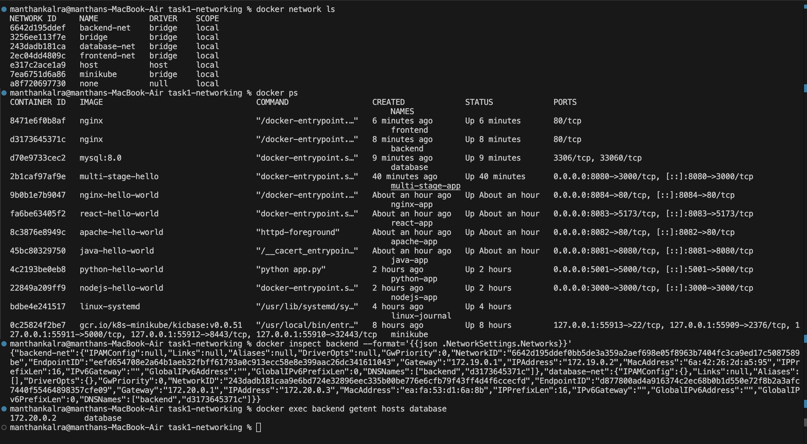
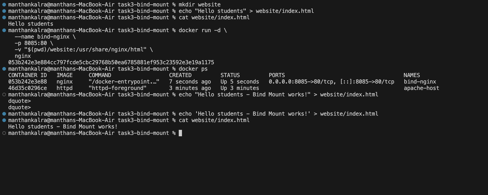

# Docker Networking & Volume Homework

## Task 1: Docker Container Networking

### Docker Networks

Created three Docker networks:

- `frontend-net`
- `backend-net`
- `database-net`

### Containers

Created three containers:

- Frontend — Nginx
- Backend — Nginx
- Database — MySQL

The backend container was connected to two networks:

- `backend-net`
- `database-net`

### Screenshots

#### Docker Networks ,Containers ,Backend Networks,Container Connectivity

---

## Task 2: Host Network

Pulled the Apache HTTP Server image and created an Apache container using the Docker host network.

The Apache website was accessed through:

`http://localhost`

### Screenshots

#### Apache Docker Container

#### Apache Webpage

---

## Task 3:

### What task was:

- Create a local folder with an index.html file containing Hello students and bind mount it to an Nginx container.

- Access the Nginx website and verify that Hello students is displayed.

- Modify the index.html file and verify that the changes appear without restarting the container.

### Screenshots:

- Website before modifying:
    

- Website after modifying:
    

- docker command :
    
---

# Task 4: Docker Overlay Network

## What is an Overlay Network?

An overlay network is a Docker network that allows containers running on
different Docker hosts to communicate with each other.

## Use Cases

- Used in Docker Swarm environments.
- Allows communication between containers on different Docker hosts.
- Useful for distributed and multi-host applications.

## How It Works

The overlay network creates a virtual network across multiple Docker hosts.
Docker uses this network to allow containers on different hosts to
communicate as if they were on the same network.

## Key Understanding

- Bridge networks are generally used for containers on the same Docker host.
- Overlay networks are designed for communication across multiple Docker hosts.
- Overlay networks are commonly used with Docker Swarm.