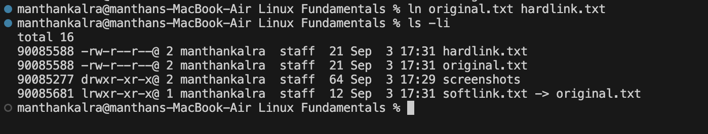
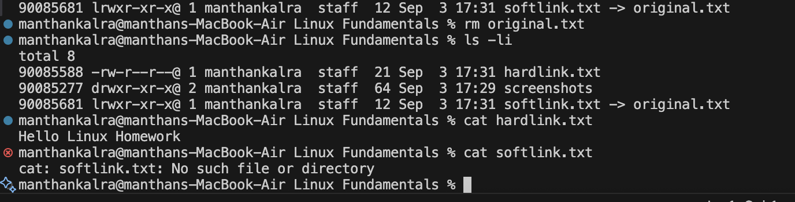
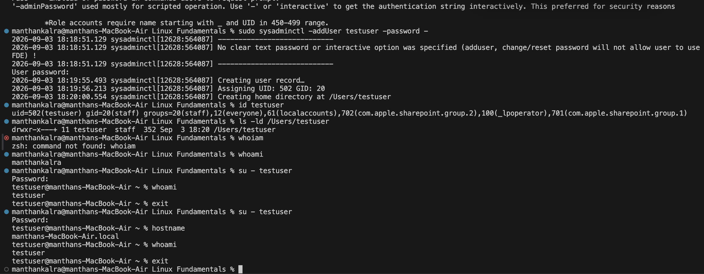
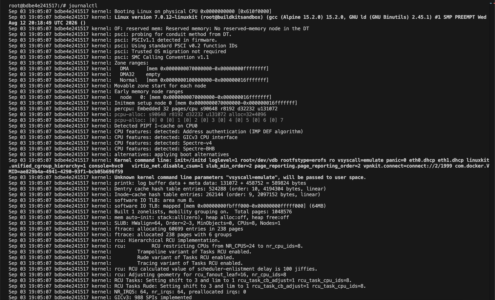
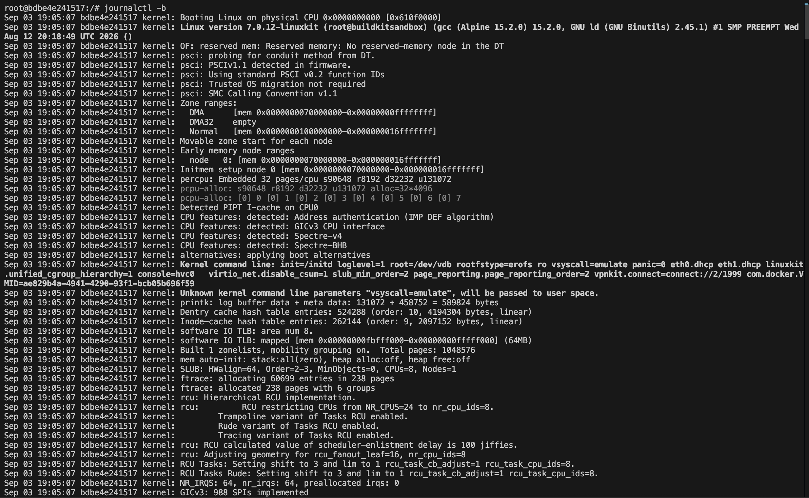
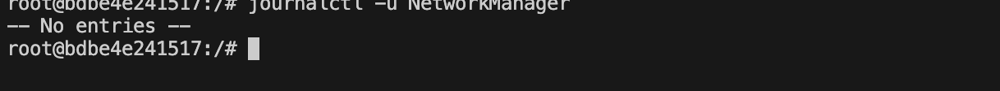

# Linux Fundamentals

## Task 1: Soft Links and Hard Links

### Difference Between Soft Links and Hard Links

* **Hard Link:** Another name for the same file. It points directly to the same inode, so both links share the same data.
* **Soft Link (Symbolic Link):** A separate file that points to the original file using its path.
* **Main Difference:** If the original file is deleted, the hard link continues to work, while the soft link becomes broken.

---

### Screenshot: Creating Soft Link and Hard Link

---

### Screenshot: After Deleting the Original File

---

## Task 2: User Creation

### Difference Between `useradd` and `adduser`

- **`useradd`:** A low-level Linux command used to create a new user. It requires more manual configuration.

- **`adduser`:** A more user-friendly and interactive command for creating a new user.

- **Main Difference:** `useradd` is a low-level command, while `adduser` provides an easier and more interactive process.

- **macOS Equivalent:** macOS does not normally provide `adduser`. The equivalent command for creating a local user is `sysadminctl`.

---

### Creating and Verifying the User

---

## Task 3:

### Usage of journalctl:
- Used to view and check system logs collected by systemd.
- Helps seeing things like system events, service errors, boot messages and troubleshooting info.

- Common usage: Check what happened when a service fail or when there is a system problem

### Screenshot of journalctl command:

---

## Task 4: