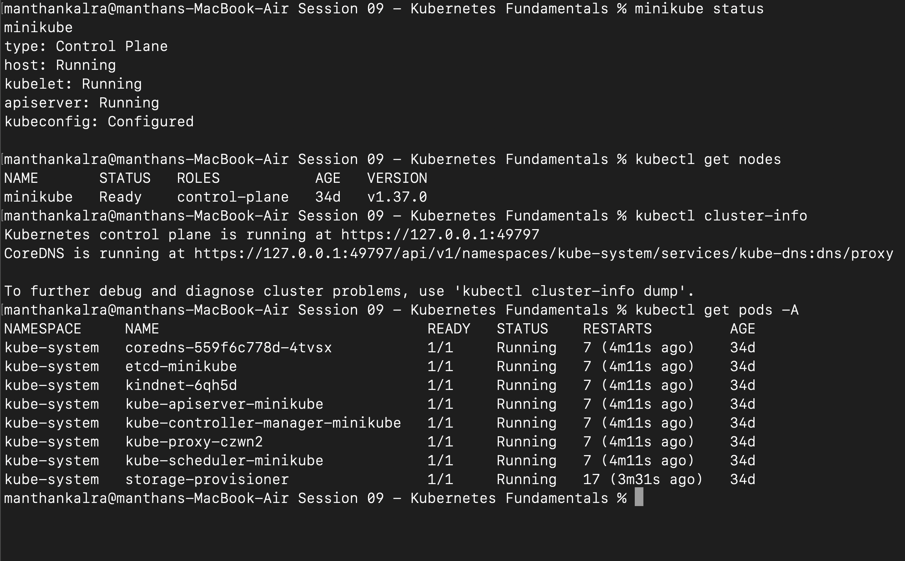
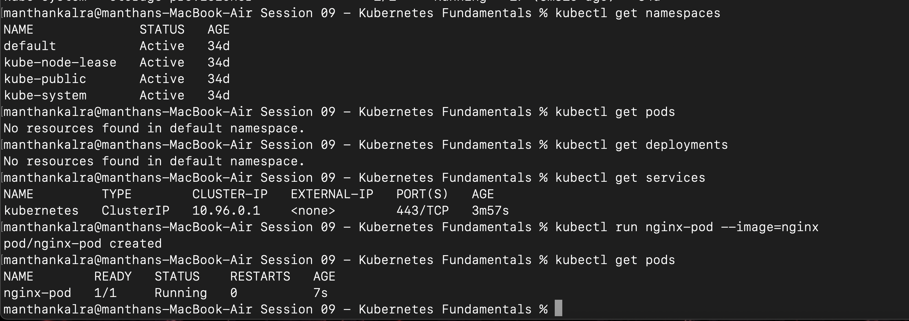
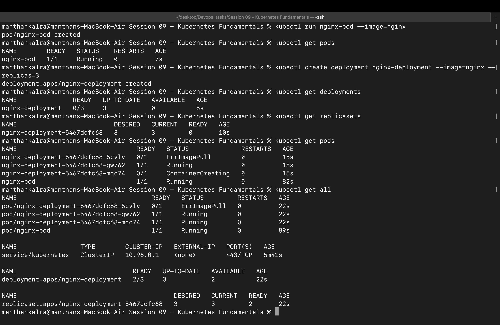
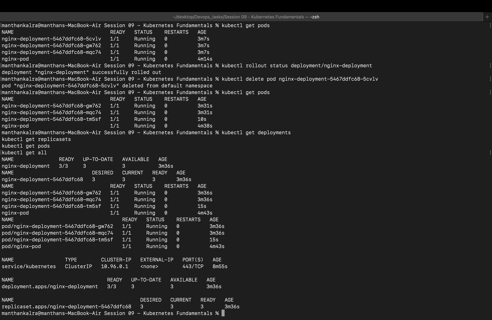
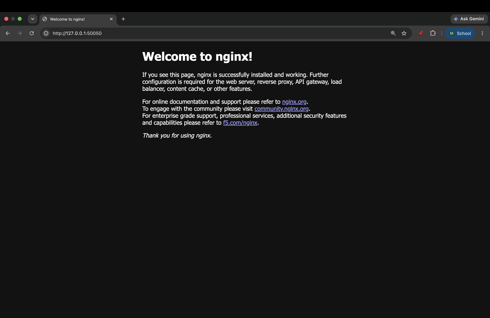
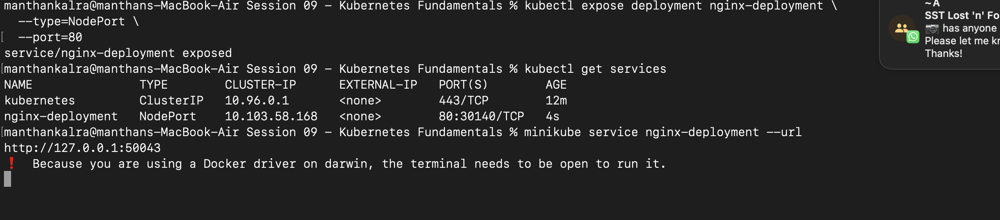
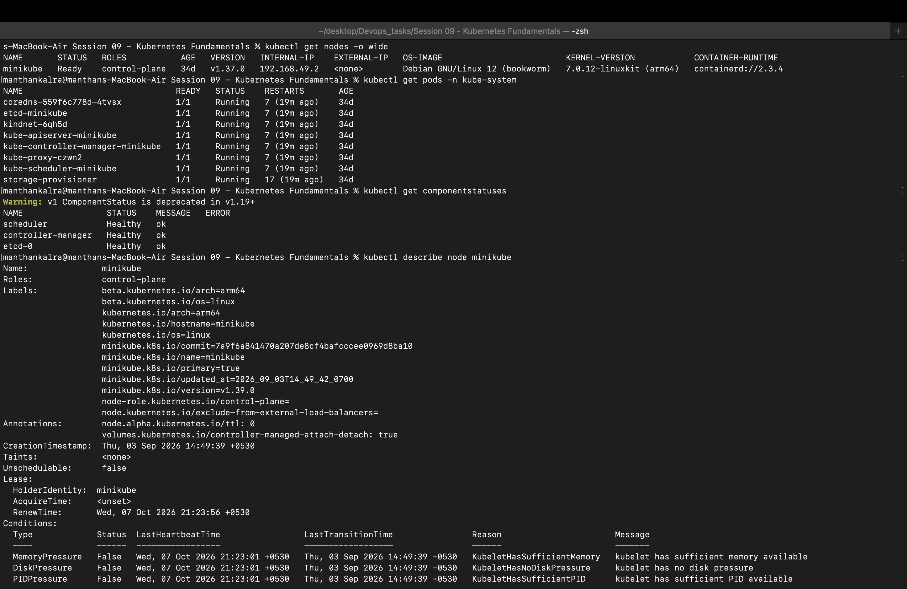
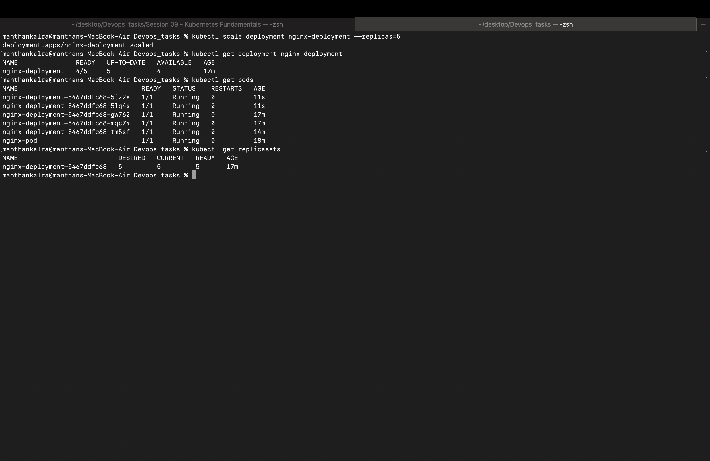
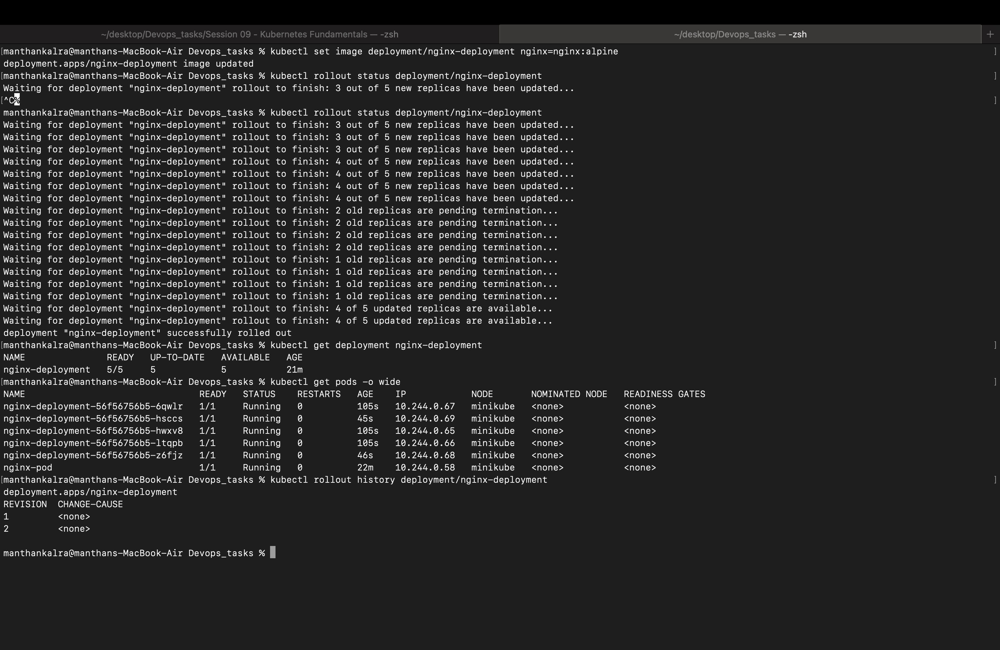
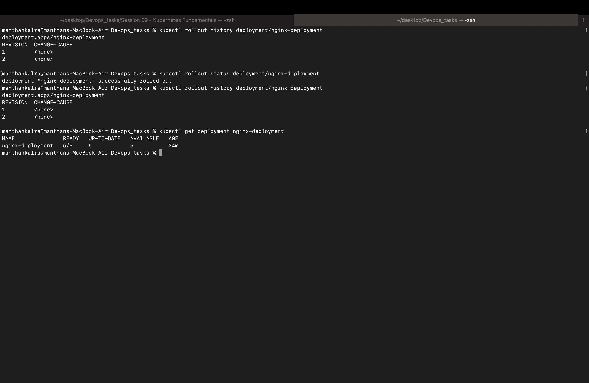

# Session 09 - Kubernetes Fundamentals

## 1. Minikube Cluster Status

## 2. Kubernetes Cluster Information

## 3. Basic Kubernetes Objects

## 4. Deployment and ReplicaSet

## 5. Nginx Service

## 6. Service Command

## 7. Kubernetes Architecture

## 8. Deployment Scaling

## 9. Deployment Update and Rollout

## 10. Deployment Rollback

