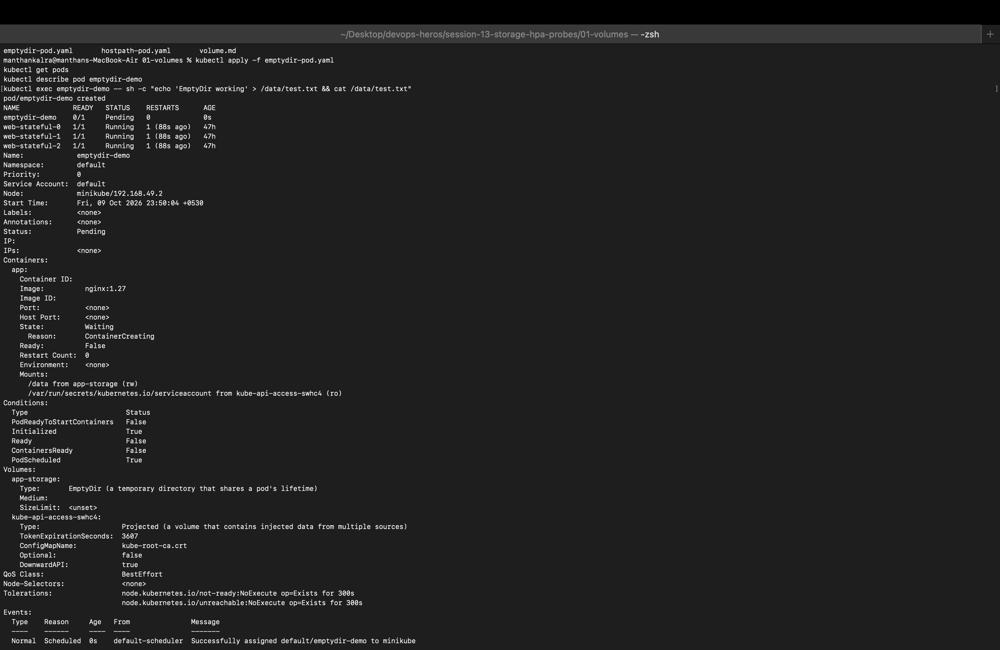
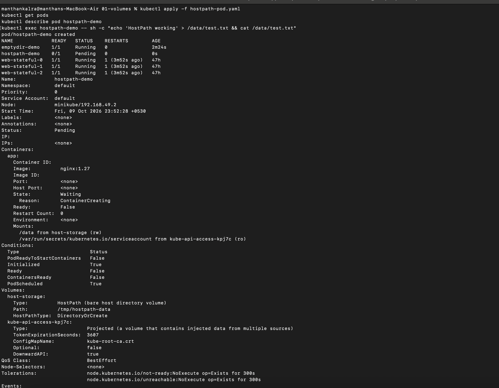
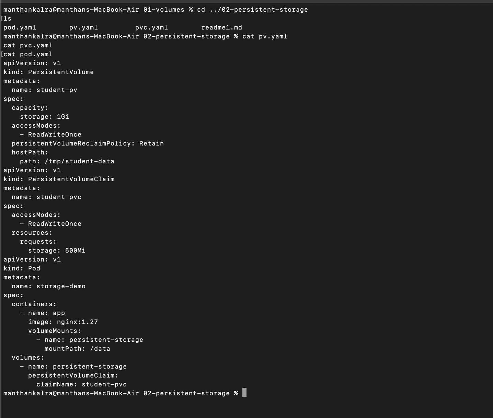
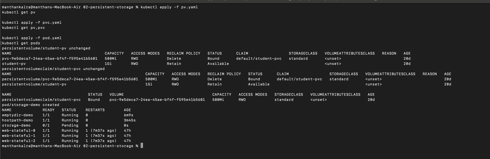
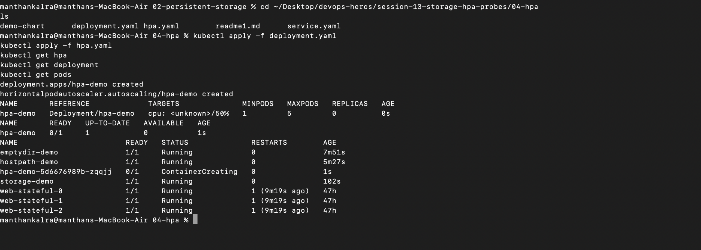
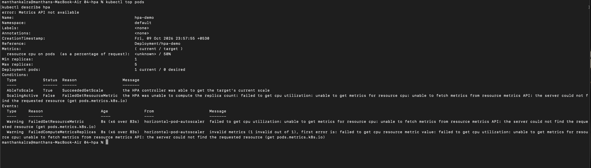
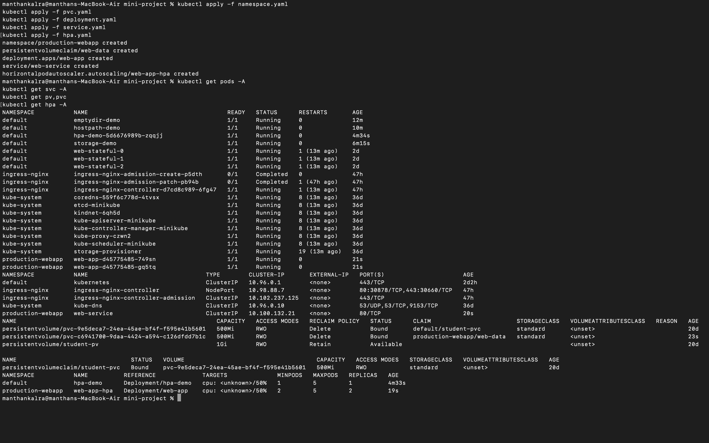
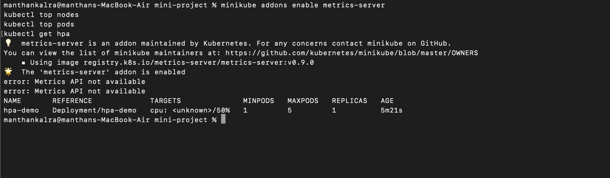

# Session 13 - Kubernetes Storage HPA Probes

## Task 1: Volumes

### EmptyDir Volume

### HostPath Volume

## Task 2: Persistent Storage

### Persistent Storage 1

### Persistent Storage 2

## Task 3: Horizontal Pod Autoscaler (HPA)

### HPA Status

### HPA Scaling

## Task 4: Mini-Project

### Mini-Project

### Mini-Project Testing
