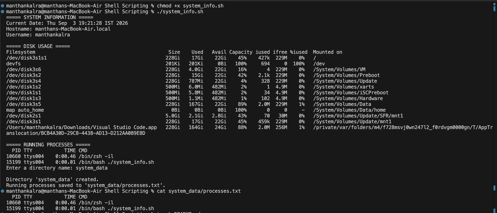

# Shell Scriptiing Homework Tasks:

## Task:
 - Created a shell script file named script.sh.
 - Contains commands that satify the condition of the task

## Script: 

[Code for the shell script](system_info.sh)

## Screenshot of shell script in running:

